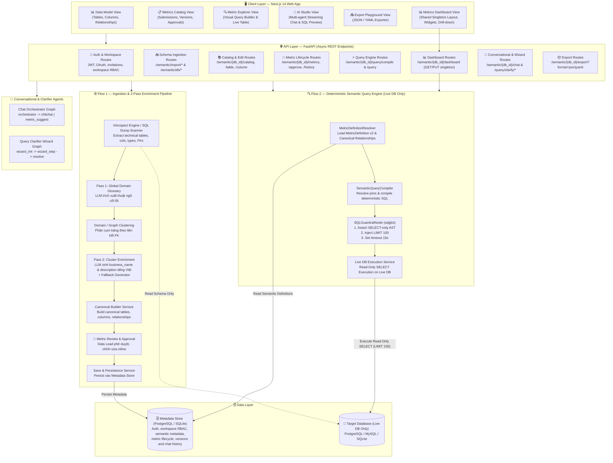
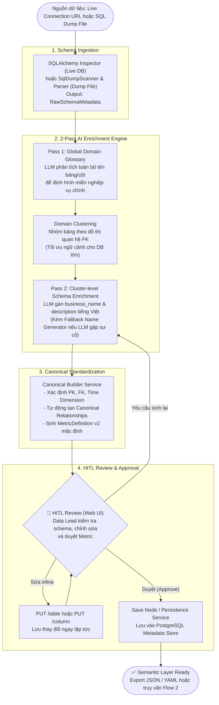
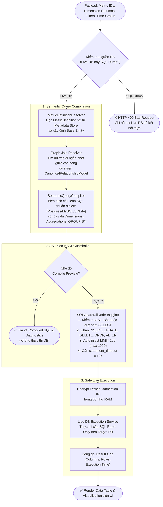
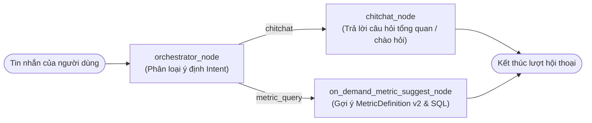
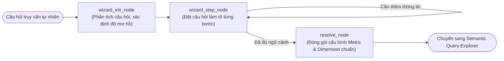
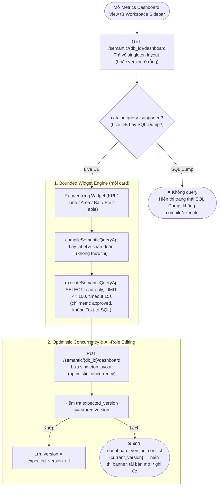
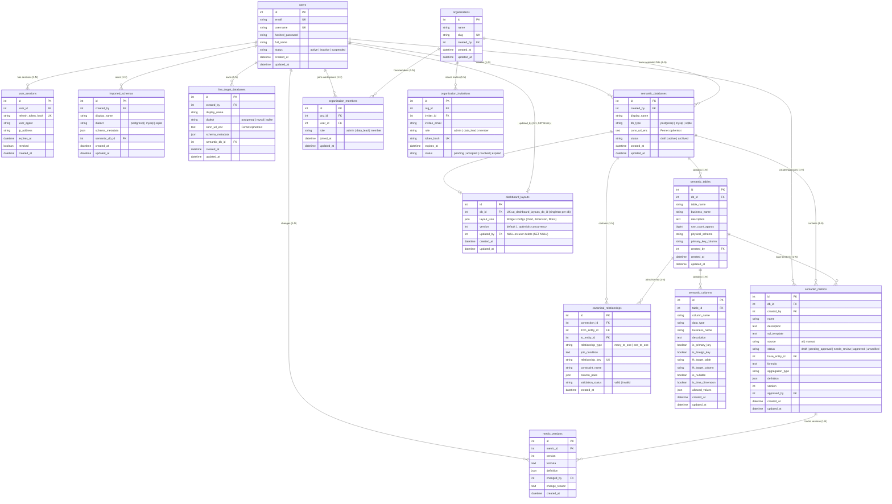

# Architecture Document — AI Semantic Layer Agent

## 1. System Overview

Hệ thống **AI Semantic Layer Agent** là nền tảng quản trị và khai thác ngữ nghĩa dữ liệu doanh nghiệp tập trung, giải quyết khoảng cách giữa cấu trúc kỹ thuật (Technical Schema) và ngữ cảnh kinh doanh (Business Context). Hệ thống bao gồm **2 luồng cốt lõi (Core Pipelines)** cùng **2 đồ thị AI hội thoại thông minh (Conversational AI Graphs)**:

- **Flow 1 — Generate & Manage Semantic Layer (Live DB & SQL Dump):**
  - **Schema Ingestion:** Hỗ trợ cả kết nối Live Database (qua SQLAlchemy Inspector) và tải lên file SQL Dump DDL (PostgreSQL, MySQL, SQLite) thông qua bộ phân tích `SqlDumpScanner & Parser`.
  - **2-Pass Hierarchical & Clustering Enrichment:**
    - *Pass 1:* Xây dựng bảng chú giải thuật ngữ toàn cục (Global Domain Glossary).
    - *Clustering:* Phân nhóm đồ thị bảng theo miền nghiệp vụ (Domain Clustering) để tối ưu xử lý schema lớn.
    - *Pass 2:* Sinh tên nghiệp vụ tiếng Việt (`business_name`) và mô tả chi tiết (`description`) cho từng bảng và cột theo cụm, đi kèm cơ chế Fallback tự động.
  - **Canonical Semantic Layer Builder:** Tự động chuẩn hóa metadata, xác định Primary Keys, Foreign Keys, Time Dimensions, quan hệ liên bảng (`canonical_relationships`) và đề xuất Business Metrics ban đầu.
  - **HITL Governance & Versioning:** Member gửi metric ở trạng thái `unverified`; Data Lead xem xét, chỉnh sửa, phê duyệt thành `approved` và quản lý lịch sử phiên bản (`metric_versions`).
  - **Export:** Đóng gói xuất Semantic Layer ra chuẩn JSON và YAML phục vụ tích hợp công cụ BI.

- **Flow 2 — Deterministic Semantic Query Engine (CHỈ DÙNG CHO LIVE DB):**
  - **Deterministic Compilation:** Người dùng chọn Metrics, Dimensions và Filters từ giao diện trực quan; `SemanticQueryCompiler` và `MetricDefinitionResolver` biên dịch thành câu lệnh SQL 100% chuẩn xác dựa trên `canonical_relationships` và metric templates.
  - **Compile-Only Preview:** Cho phép kiểm tra câu lệnh SQL được sinh ra và chẩn đoán cấu trúc mà không cần kết nối/thực thi trên Target DB.
  - **Security Guardrails:** Tích hợp `sqlglot` kiểm tra AST (ép duy nhất lệnh `SELECT`, chặn hoàn toàn `INSERT`, `UPDATE`, `DELETE`, `DROP`, `ALTER`), tự động inject `LIMIT 100` (tối đa 1000 rows) và gán `statement_timeout = 15s`.
  - **Read-Only Execution:** Thực thi an toàn trên Live Database và trả về bảng kết quả dạng JSON.

- **Conversational & Interactive Layer:**
  - **Chat Orchestrator Graph:** Tự động phân loại Intent giữa trò chuyện chung (`chitchat_node`) và yêu cầu định nghĩa chỉ số nghiệp vụ (`on_demand_metric_suggest_node`).
  - **Query Clarifier Wizard Graph:** Hỗ trợ người dùng làm rõ các câu truy vấn phức tạp hoặc còn mơ hồ qua từng bước gợi ý thông minh (`wizard_init` $\rightarrow$ `wizard_step` $\rightarrow$ `resolve`).

---

## 2. Architecture Diagram

---

## 3. Detailed Component Workflows

### 3.1. Flow 1: 2-Pass Hierarchical & Clustering Enrichment Pipeline

---

### 3.2. Flow 2: Deterministic Semantic Query Pipeline (Live DB Only)

---

### 3.3. Conversational Multi-Agent & Query Clarifier Graphs

#### A. Chat Orchestrator Graph (`src/agents/chat_graph.py`)

#### B. Query Clarifier Wizard Graph (`src/agents/query_clarifier/graph.py`)

---

### 3.4. Visual Dashboard — Shared Singleton Layout (Live DB Only)

**Quy tắc an toàn cốt lõi của Dashboard:**

1. **Singleton chia sẻ (Shared Singleton):** Mỗi Semantic Database có đúng một hàng `dashboard_layouts` (khóa `uq_dashboard_layouts_db_id`). Layout là tài sản chung của toàn Workspace, không lưu trên `localStorage` và không phân biệt người dùng — mọi thay đổi đều hiển thị cho tất cả thành viên.
2. **Live-DB-only execution:** Dashboard chỉ gọi `compileSemanticQueryApi` / `executeSemanticQueryApi` khi `catalog.query_supported = true` (Live DB). Với SQL Dump, Dashboard hiển thị trạng thái riêng và **không bao giờ** phát sinh bất kỳ lệnh compile/execute nào.
3. **Approved-only & Deterministic:** Chỉ các metric có `status = approved`, định nghĩa v2 và không có diagnostics mới khả dụng; mỗi widget biên dịch qua `SemanticQueryCompiler` (không dùng Text-to-SQL tự do). Mọi truy vấn chạy qua `executeSemanticQueryApi` nên thừa hưởng guardrail `sqlglot` (SELECT-only, `LIMIT <= 100`, `statement_timeout = 15s`).
4. **All-role shared editing:** Mọi vai trò Workspace (`admin`, `data_lead`, `member`) đều có thể sửa Dashboard chia sẻ, với điều kiện là thành viên Workspace và có quyền `can_query`. Database cá nhân chỉ cho phép người tạo; database Workspace không có header org dùng membership đơn lẻ; database ngoài org bị che thành 404.
5. **Optimistic concurrency:** Mỗi `PUT` mang `expected_version`. Nếu không khớp với version đang lưu, backend trả `409` với payload ổn định `{"code": "dashboard_version_conflict", "current_version": <int>}`; xung đột hiển thị rõ ràng và có thể phục hồi (tải bản mới hoặc ghi đè sau khi tải lại), không áp dụng last-write-wins thầm lặng.

---

## 4. Tech Stack Specification

| Thành phần / Tầng | Công nghệ / Thư viện | Phiên bản | Vai trò & Lý do lựa chọn |
|---|---|---|---|
| **API Framework** | **FastAPI** | $\ge 0.115$ | Xử lý bất đồng bộ (Async IO), OpenAPI auto docs, hiệu năng cao |
| **ASGI Server** | **Uvicorn** | $\ge 0.34$ | ASGI server tiêu chuẩn, hỗ trợ hot-reload trong môi trường phát triển |
| **Data Validation** | **Pydantic v2** | $\ge 2.10$ | Ép kiểu dữ liệu request/response nghiêm ngặt, serializing nhanh |
| **Configuration** | **pydantic-settings** | $\ge 2.7$ | Nạp cấu hình từ `.env` với Type Hints đầy đủ |
| **Agent Orchestration** | **LangGraph** | $\ge 0.2$ | StateGraph điều phối luồng xử lý đa tác tử và cơ chế HITL Interrupt |
| **LLM Framework** | **LangChain** | $\ge 0.3$ | Prompt templates và abstractions tương tác mô hình |
| **LLM Provider** | **OpenAI GPT-4o-mini** | API | Chi phí tối ưu, output đồng nhất với `temperature = 0.0` |
| **Database ORM & Metadata** | **SQLAlchemy** | $\ge 2.0$ | AsyncEngine/Session ORM kết hợp Inspector API đọc schema |
| **SQL Parser & Guardrails** | **sqlglot** | $\ge 25.0$ | Phân tích cú pháp SQL AST, xác thực Read-Only, inject LIMIT & Timeout |
| **Database Migrations** | **Alembic** | $\ge 1.14$ | Quản lý lịch sử thay đổi cấu trúc Metadata Store an toàn |
| **Metadata Database** | **PostgreSQL / SQLite** | 16-alpine | PostgreSQL cho Production/Docker và SQLite cho môi trường test nhanh |
| **Database Drivers** | **asyncpg**, **aiosqlite**, **psycopg2** | Standard | Driver async cho PostgreSQL và SQLite |
| **Security & Auth** | **cryptography (Fernet)**, **python-jose**, **passlib (bcrypt)** | Standard | Mã hóa đối xứng Connection URL; băm mật khẩu và JWT token |
| **Export Formats** | **PyYAML**, **json** | $\ge 6.0$ | Xuất khẩu Semantic Layer phục vụ tích hợp công cụ BI |
| **Frontend Framework** | **Next.js 14 (App Router)** | 14.2+ | React server/client components, tối ưu SEO và routing linh hoạt |
| **Frontend Styling** | **Tailwind CSS**, **Lucide React** | Standard | Thiết kế giao diện hiện đại, responsive, icon phong phú |
| **Code Viewer & Highlighting** | **PrismJS** | Standard | Highlight cú pháp SQL và YAML trên giao diện Web UI |
| **DevOps & Containers** | **Docker & Docker Compose** | Multi-stage | Đồng bộ môi trường Dev / Staging / Production |
| **Testing Framework** | **pytest, pytest-asyncio, httpx** | $\ge 8.0$ | Async unit & integration testing với mock LLM/DB |

---

## 5. Architectural Design Decisions

| Quyết định Kiến trúc | Lựa chọn Thực tế | Phương án Thay thế đã Xét | Lý do & Giá trị mang lại |
|---|---|---|---|
| **Query Engine Pattern** | **Deterministic Semantic Compilation** | Text-to-SQL tự do qua LLM | Đảm bảo tính chính xác 100%, không ảo giác, loại trừ rủi ro SQL Injection và lỗi cú pháp. |
| **Phạm vi Query Execution** | **CHỈ áp dụng Live DB** | Áp dụng cho cả SQL Dump | SQL Dump chỉ chứa DDL cấu trúc, không có môi trường chạy dữ liệu thực tế. |
| **Schema Enrichment** | **2-Pass Hierarchical + Clustering** | 1-Pass Flat Prompting | Tối ưu context window của LLM cho database lớn (> 20-50 bảng), đảm bảo từ vựng nghiệp vụ nhất quán trên toàn hệ thống. |
| **Bảo vệ Dữ liệu Live DB** | **sqlglot AST Inspection + Read-Only SELECT** | Phân quyền DB user thuần túy | Ngăn ngừa mọi hành vi sửa đổi dữ liệu ở cấp độ ứng dụng, tự động gán trần `LIMIT 100` và `timeout = 15s`. |
| **Lưu trữ Thông tin Nhạy cảm** | **Fernet Symmetric Encryption** | Lưu Plaintext / Hashing một chiều | Fernet cho phép giải mã 2 chiều an toàn trong bộ nhớ khi cần kết nối lại DB mà không để lộ connection string ra ngoài. |
| **Quản trị Chỉ số (Metrics)** | **MetricDefinition v2 + Version History** | Lưu chuỗi SQL tự do | Hỗ trợ quản trị công thức, kiểu tổng hợp (`SUM`, `COUNT`, `AVG`...), bộ lọc độc lập và truy vết lịch sử thay đổi phiên bản. |
| **Phân quyền Ứng dụng** | **Workspace-scoped RBAC** (`admin`, `data_lead`, `member`) | Vai trò toàn cục trên tài khoản | Một người có thể giữ vai trò khác nhau theo Workspace; JWT/profile không chứa vai trò ứng dụng toàn cục. |
| **Visual Dashboard Layout** | **Singleton chia sẻ + Optimistic Concurrency** | `localStorage` / nhiều dashboard theo user / last-write-wins | Một layout chung mỗi Semantic Database (key `db_id`), mọi vai trò Workspace có `can_query` đều sửa được; xung đột version hiển thị rõ và phục hồi được, không ghi đè thầm lặng. |

---

## 6. Database Schema — Metadata Store

Các bảng ORM được định nghĩa trong `src/models/db.py`. RBAC chỉ tồn tại trên membership của từng Workspace; bảng `users` không có cột role.

---

## 7. Security & Governance Principles

1. **Schema-Only Introspection:** Agent không bao giờ truy vấn dữ liệu nhạy cảm của khách hàng trong bước sinh Semantic Layer.
2. **Deterministic Query Compilation:** Không để LLM tự viết SQL lúc truy vấn dữ liệu thực tế nhằm loại bỏ hoàn toàn các rủi ro bảo mật và sai sót công thức.
3. **Double Guardrails on Execution:** Mọi câu truy vấn gửi tới Live DB đều được bọc kiểm tra AST với `sqlglot`, gán cứng trần `LIMIT 100` và `timeout = 15s`.
4. **Credential Isolation:** Toàn bộ chuỗi kết nối Target DB được mã hóa Fernet đối xứng trước khi ghi vào Database và chỉ giải mã trong RAM khi thực thi tác vụ.
5. **Workspace-scoped RBAC:** `admin` chỉ quản trị thành viên và invitation trong Workspace hiện tại, không phải quản trị viên toàn nền tảng. `data_lead` quản trị schema và metric; `member` chỉ gửi metric mới. Cả ba vai trò được xem catalog đã duyệt, query Live DB và dùng chat/data assistant.
6. **Last-admin Invariant:** Workspace luôn phải còn ít nhất một `admin`; mọi thao tác hạ vai trò hoặc xóa admin cuối cùng đều bị từ chối, kể cả tự hạ vai trò hoặc tự rời Workspace.
7. **Invitation Safety:** Chỉ Workspace Admin tạo/thu hồi URL mời. Link chứa vai trò `admin|data_lead|member`, token chỉ lưu dưới dạng hash, dùng một lần và hết hạn sau 7 ngày.
8. **Metric Review Boundary:** Submission của Member được server ép thành `unverified`, bất biến đối với Member, và trước khi duyệt chỉ hiển thị cho người tạo cùng Data Lead. Data Lead có thể sửa, xóa hoặc chuyển `unverified` thành `approved`; Admin chỉ xem catalog `approved`. Query compiler chỉ chấp nhận metric `approved`.
9. **Shared Dashboard Governance:** Dashboard là tài sản chung của Workspace, mọi vai trò có `can_query` đều được sửa (không phân biệt admin/data_lead/member). Truy vấn chỉ chạy trên Live DB đã duyệt (`query_supported`); SQL Dump không phát sinh query. Xung đột ghi đồng thời được phát hiện qua `expected_version` và trả `409 dashboard_version_conflict` với `current_version` để người dùng phục hồi, không ghi đè thầm lặng.
