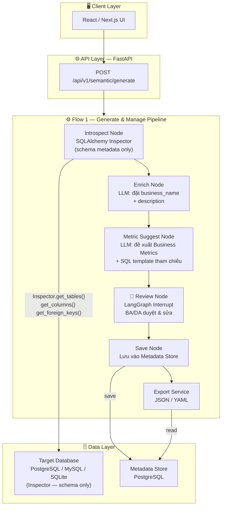
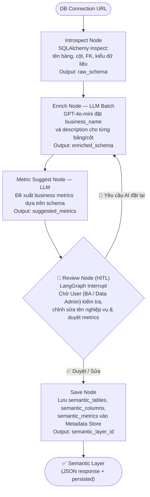

# Architecture Document — AI Semantic Layer Agent

## System Overview

Hệ thống **AI Semantic Layer Agent v1.0** tập trung vào **1 pipeline duy nhất**:

- **Flow 1 — Generate & Manage Semantic Layer:** Kết nối tới Target DB → AI tự động introspect schema kỹ thuật → LLM đề xuất tên nghiệp vụ, mô tả cột, Business Metrics → BA/DA review & duyệt (HITL) → lưu vào Metadata Store → xuất JSON/YAML.

Kiến trúc sử dụng **LangGraph StateGraph** với HITL Interrupt cho bước review. Kết nối Target DB chỉ dùng **SQLAlchemy Inspector** để đọc schema metadata — **không thực thi query data**.

---

## Architecture Diagram

---

## Flow 1 — Generate Pipeline (Chi tiết với HITL)

---

## Tech Stack

| Layer | Technology | Version | Lý do |
|-------|-----------|---------|-------|
| API Framework | **FastAPI** | ≥ 0.115 | Async, auto docs |
| ASGI Server | **Uvicorn** | ≥ 0.34 | Performance, hot-reload |
| Data Validation | **Pydantic v2** | ≥ 2.10 | Type-safe request/response |
| Config | **pydantic-settings** | ≥ 2.7 | Load `.env` typed |
| Agent Orchestrator | **LangGraph** | ≥ 0.2 | StateGraph + HITL Interrupt |
| LLM Framework | **LangChain** | ≥ 0.3 | Prompt templates |
| LLM | **GPT-4o-mini** | API | Cost-efficient, deterministic (T=0.0) |
| DB Abstraction | **SQLAlchemy** | ≥ 2.0 | Inspector API + Metadata Store ORM |
| Migration | **Alembic** | ≥ 1.14 | Metadata Store schema migration |
| Export | **pyyaml** | ≥ 6.0 | Export Semantic Layer → YAML |
| PostgreSQL Driver | **psycopg2-binary** | ≥ 2.9 | Driver cho Metadata Store PostgreSQL |
| Container | **Docker** multi-stage | — | Dev/prod separation |
| CI/CD | **GitHub Actions** | — | Auto test + deploy |
| Testing | **pytest + pytest-asyncio + httpx** | — | Async API testing |
| Monitoring | **Langfuse** | ≥ 2.0 | LLM observability: traces, token cost, HITL quality |

---

## Design Decisions

| Quyết định | Lựa chọn | Thay thế đã xét | Lý do |
|---|---|---|---|
| Scope v1.0 | **1 pipeline: Generate & Manage** | 2 pipelines (Generate + Query) | Tập trung vào giá trị cốt lõi — Semantic Governance — trước khi mở rộng NL2SQL |
| HITL mechanism | **LangGraph Interrupt + CRUD API** | Full auto AI, không review | BA/DA phải là người duyệt cuối cùng — đảm bảo accuracy nghiệp vụ |
| DB access pattern | **SQLAlchemy Inspector (schema only)** | SQLAlchemy execute + read data | Zero risk đọc nhầm data nhạy cảm; không cần quyền SELECT data |
| LLM | **GPT-4o-mini, T=0.0** | GPT-4o | Cost-efficient, đủ cho enrichment task; deterministic output |
| DB abstraction | **SQLAlchemy** | Raw psycopg2 driver | Multi-DB Inspector API built-in (Postgres/MySQL/SQLite) |
| Credential storage | **Fernet encryption** | Plaintext / bcrypt | Reversible (cần decrypt để introspect lại); symmetric key an toàn |
| Export format | **JSON + YAML** | JSON only | YAML tương thích dbt, Looker; JSON cho REST API consumers |

---

## DB Schema — Metadata Store

Các bảng trong PostgreSQL **Metadata Store** (không phải Target DB):

| Bảng | Mô tả |
|------|-------|
| `semantic_databases` | Thông tin Target DB: `id`, `display_name`, `db_type`, `conn_url_enc` (Fernet), `created_at` |
| `semantic_tables` | Bảng được enrich: `id`, `db_id (FK)`, `table_name`, `business_name`, `description` |
| `semantic_columns` | Cột được enrich: `id`, `table_id (FK)`, `column_name`, `data_type`, `business_name`, `description` |
| `semantic_metrics` | Business Metrics: `id`, `db_id (FK)`, `name`, `description`, `sql_template`, `source (ai\|manual)`, `created_at` |

> **Lưu ý:** `conn_url_enc` luôn lưu dưới dạng Fernet ciphertext. Decrypt trong memory khi cần introspect lại — không bao giờ log plaintext.

---
