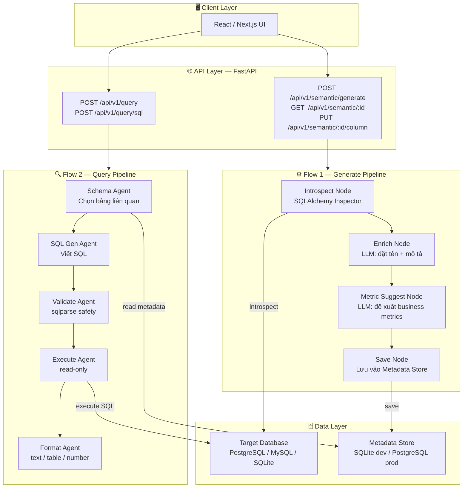
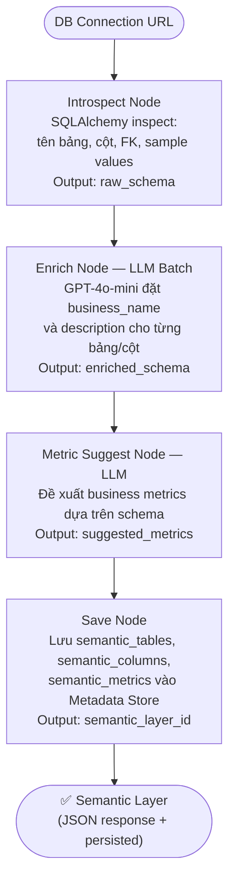
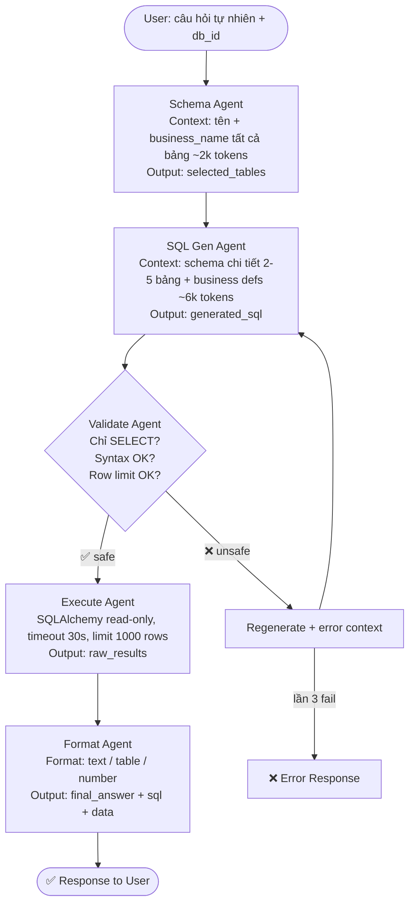

# Architecture Document — AI Semantic Layer Agent

## System Overview

Hệ thống AI Agent end-to-end gồm **2 pipeline chính**:

- **Flow 1 — Generate:** Kết nối tới bất kỳ DB nào → AI tự động phân tích schema kỹ thuật → tạo ra **Semantic Layer** (đặt tên nghiệp vụ, mô tả cột, đề xuất metrics).
- **Flow 2 — Query:** Người dùng đặt câu hỏi tự nhiên → Agent dùng Semantic Layer đã có → generate SQL → thực thi → trả kết quả data.

Kiến trúc sử dụng **LangGraph Multi-Agent** để phân tách context, giảm chi phí LLM và tăng độ chính xác.

---

## Architecture Diagram



---

## Flow 1 — Generate Pipeline (Chi tiết)



---

## Flow 2 — Query Pipeline (Chi tiết)



---

## API Endpoints

### Flow 1 — Semantic Layer

| Method | Endpoint | Input | Output |
|--------|----------|-------|--------|
| `POST` | `/api/v1/semantic/generate` | `{ connection_url, db_name }` | Semantic Layer JSON |
| `GET` | `/api/v1/semantic/{db_id}` | — | Semantic Layer đã lưu |
| `PUT` | `/api/v1/semantic/{db_id}/table/{table}` | `{ business_name, description }` | Updated table def |
| `PUT` | `/api/v1/semantic/{db_id}/column/{table}/{col}` | `{ business_name, description }` | Updated column def |
| `POST` | `/api/v1/semantic/{db_id}/metric` | `{ name, description, sql_template }` | New metric |

### Flow 2 — Query

| Method | Endpoint | Input | Output |
|--------|----------|-------|--------|
| `POST` | `/api/v1/query` | `{ db_id, question }` | `{ answer, format }` |
| `POST` | `/api/v1/query/sql` | `{ db_id, question }` | `{ answer, sql, data, format }` |

---

## AgentState Schemas

### GenerateState (Flow 1)

```python
class GenerateState(TypedDict, total=False):
    connection_url: str        # Input: DB URL
    db_id: str                 # Generated DB identifier

    raw_schema: dict           # Introspect Node output
    enriched_schema: dict      # Enrich Node output (+ business names)
    suggested_metrics: list    # Metric Suggest Node output

    semantic_layer_id: str     # Save Node output
    error: str
```

### QueryState (Flow 2)

```python
class QueryState(TypedDict, total=False):
    user_question: str         # Input: câu hỏi tự nhiên
    db_id: str                 # Input: DB cần query

    selected_tables: list[str] # Schema Agent output
    schema_context: str        # Schema chi tiết các bảng chọn
    semantic_context: str      # Business definitions từ Metadata Store

    generated_sql: str         # SQL Gen Agent output
    is_safe: bool              # Validate Agent output
    validation_error: str

    raw_results: list[dict]    # Execute Agent output
    row_count: int

    final_answer: str          # Format Agent output
    answer_sql: str            # SQL đã dùng (debug mode)
    answer_format: str         # "text" | "table" | "number"

    retry_count: int
    error: str
```

---

## Metadata Store Schema

```sql
-- Thông tin DB đã đăng ký
semantic_databases (
    id            TEXT PRIMARY KEY,
    name          TEXT,
    db_type       TEXT,           -- postgresql, mysql, sqlite
    conn_url_enc  TEXT,           -- encrypted connection URL
    created_at    TIMESTAMP
)

-- Ngữ nghĩa cấp bảng
semantic_tables (
    id            TEXT PRIMARY KEY,
    db_id         TEXT FK,
    table_name    TEXT,           -- tên kỹ thuật
    business_name TEXT,           -- "Giao dịch người dùng"
    description   TEXT            -- "Lưu lịch sử giao dịch..."
)

-- Ngữ nghĩa cấp cột
semantic_columns (
    id            TEXT PRIMARY KEY,
    table_id      TEXT FK,
    column_name   TEXT,           -- "trx_amt"
    business_name TEXT,           -- "Giá trị giao dịch (VND)"
    description   TEXT,
    data_type     TEXT,
    example_values TEXT           -- JSON array
)

-- Business metrics
semantic_metrics (
    id            TEXT PRIMARY KEY,
    db_id         TEXT FK,
    name          TEXT,           -- "Monthly Revenue"
    description   TEXT,
    sql_template  TEXT            -- "SELECT SUM(amount) FROM orders WHERE..."
)
```

---

## Tech Stack

| Layer | Technology | Version | Lý do |
|-------|-----------|---------|-------|
| API Framework | **FastAPI** | ≥ 0.115 | Async, streaming, auto docs |
| ASGI Server | **Uvicorn** | ≥ 0.34 | Performance, hot-reload |
| Data Validation | **Pydantic v2** | ≥ 2.10 | Type-safe request/response |
| Config | **pydantic-settings** | ≥ 2.7 | Load `.env` typed |
| Agent Orchestrator | **LangGraph** | ≥ 0.2 | Multi-agent, stateful, retry |
| LLM Framework | **LangChain** | ≥ 0.3 | Prompt templates, tools |
| SQL Toolkit | **langchain-community** | ≥ 0.3 | SQLDatabaseToolkit |
| LLM | **GPT-4o-mini** | API | Cost-efficient NL2SQL |
| DB Abstraction | **SQLAlchemy** | ≥ 2.0 | Multi-DB, introspect API |
| Migration | **Alembic** | ≥ 1.14 | Schema migration |
| SQL Safety | **sqlparse** | ≥ 0.5 | AST parse, whitelist SELECT |
| Async SQLite | **aiosqlite** | ≥ 0.19 | Dev local |
| PostgreSQL | **psycopg2-binary** | ≥ 2.9 | Prod driver |
| Container | **Docker** multi-stage | — | Dev/prod separation |
| CI/CD | **GitHub Actions** | — | Auto test + deploy |
| Linter | **Ruff** | ≥ 0.8 | Fast lint + format |
| Testing | **pytest + pytest-asyncio + httpx** | — | Async API testing |

---

## Cấu trúc thư mục

```
src/
├── agents/
│   ├── generate/                  # Flow 1
│   │   ├── graph.py
│   │   ├── state.py
│   │   └── nodes/
│   │       ├── introspect_node.py
│   │       ├── enrich_node.py
│   │       ├── metric_suggest_node.py
│   │       └── save_node.py
│   └── query/                     # Flow 2
│       ├── graph.py
│       ├── state.py
│       └── nodes/
│           ├── schema_node.py
│           ├── sql_gen_node.py
│           ├── validate_node.py
│           ├── execute_node.py
│           └── format_node.py
├── api/
│   └── routes/
│       ├── semantic.py            # /api/v1/semantic/*
│       └── query.py               # /api/v1/query/*
├── models/
│   └── schemas.py
├── services/
│   ├── llm.py
│   ├── schema_service.py          # SQLAlchemy introspection
│   ├── metadata_service.py        # Semantic metadata CRUD
│   └── safety_service.py          # sqlparse validation
├── db/
│   ├── models.py                  # SQLAlchemy ORM (Metadata Store)
│   └── session.py
├── config.py
└── main.py
```

---

## Security

| Rủi ro | Biện pháp |
|--------|-----------|
| Destructive SQL | sqlparse whitelist: chỉ `SELECT` |
| SQL Injection | SQLAlchemy parameterized queries |
| Data overload | Hard limit 1000 rows + timeout 30s |
| DB credential leak | Encrypt `conn_url` trong Metadata Store |
| Prompt injection | Sanitize user input trước khi vào prompt |

---

## Design Decisions

| Quyết định | Lựa chọn | Thay thế xét | Lý do |
|-----------|---------|-------------|-------|
| Agent pattern | Multi-Agent Handoff | Single monolithic agent | Phân tách context, giảm cost, dễ retry từng bước |
| Schema selection | LLM Schema Agent | Vector DB ChromaDB | Không cần infra thêm, có reasoning |
| LLM | GPT-4o-mini | GPT-4o | Cost 10x rẻ hơn, đủ accuracy NL2SQL |
| DB abstraction | SQLAlchemy | Raw driver | Multi-DB support, introspection API |
| SQL safety | sqlparse AST | Regex | Chính xác, không bị bypass |
| 2 pipelines | Generate + Query tách biệt | 1 pipeline gộp | Rõ ràng, dễ test riêng từng flow |

---

## requirements.txt

```txt
# Core
fastapi>=0.115.0
uvicorn[standard]>=0.34.0
pydantic>=2.10.0
pydantic-settings>=2.7.0
python-dotenv>=1.0.0

# AI / LangChain
langchain>=0.3.0
langchain-openai>=0.3.0
langchain-community>=0.3.0
langgraph>=0.2.0

# Database
sqlalchemy>=2.0.0
alembic>=1.14.0
aiosqlite>=0.19.0
psycopg2-binary>=2.9.0

# SQL Safety
sqlparse>=0.5.0

# Dev tools
ruff>=0.8.0
pytest>=8.0.0
pytest-asyncio>=0.24.0
httpx>=0.28.0
```
