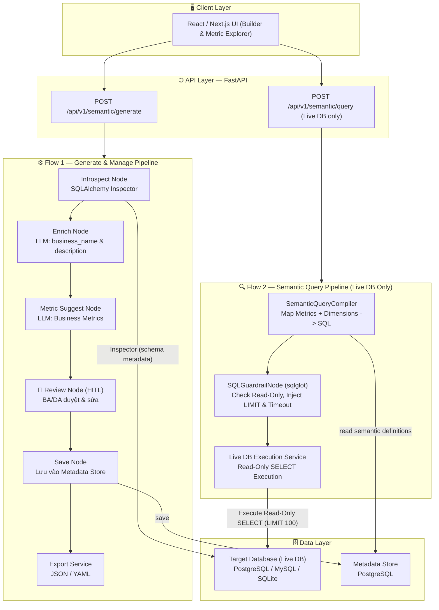
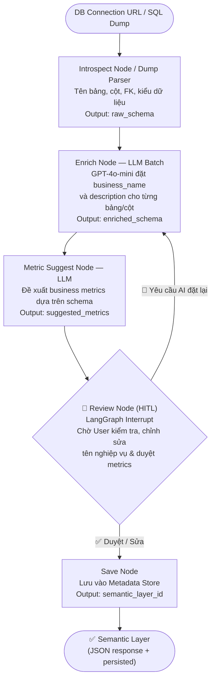
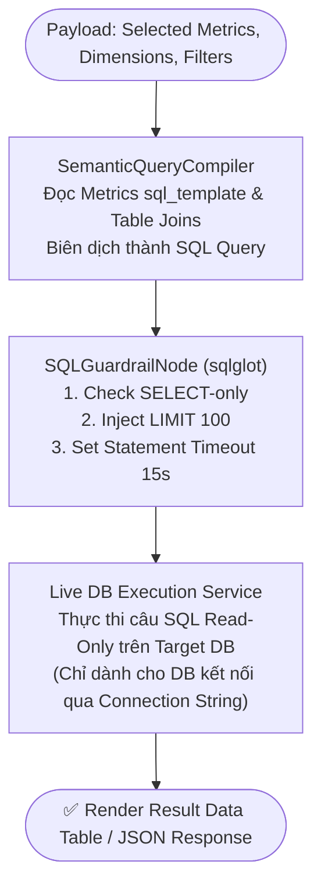

# Architecture Document — AI Semantic Layer Agent

## System Overview

Hệ thống **AI Semantic Layer Agent v1.0** bao gồm **2 luồng chính**:

- **Flow 1 — Generate & Manage Semantic Layer:** Kết nối tới Target DB (hoặc import SQL Dump) → AI tự động introspect schema kỹ thuật → LLM đề xuất tên nghiệp vụ, mô tả cột, Business Metrics → BA/DA review & duyệt (HITL) → lưu vào Metadata Store → xuất JSON/YAML.
- **Flow 2 — Semantic Layer Query Engine (CHỈ DÙNG CHO CONNECTION STRING / LIVE DB):** Người dùng lựa chọn Metrics & Dimensions từ Semantic Layer → `SemanticQueryCompiler` tự động biên dịch thành câu lệnh SQL chuẩn xác → Thực thi Read-Only trên Live DB kèm Guardrails (Limit, Timeout) → Trả kết quả bảng/dữ liệu lên UI. *Không áp dụng cho SQL Dump.*

---

## Architecture Diagram

---

## Flow 1 — Generate Pipeline (Chi tiết với HITL)

---

## Flow 2 — Query Pipeline (Chi tiết cho Live DB)

---

## Tech Stack

| Layer | Technology | Version | Lý do |
|-------|-----------|---------|-------|
| API Framework | **FastAPI** | ≥ 0.115 | Async, auto docs |
| ASGI Server | **Uvicorn** | ≥ 0.34 | Performance, hot-reload |
| Data Validation | **Pydantic v2** | ≥ 2.10 | Type-safe request/response |
| Config | **pydantic-settings** | ≥ 2.7 | Load `.env` typed |
| Agent Orchestrator | **LangGraph** | ≥ 0.2 | StateGraph + HITL Interrupt |
| LLM Framework | **LangChain** | ≥ 0.3 | Prompt templates |
| LLM | **GPT-4o-mini** | API | Cost-efficient, deterministic (T=0.0) |
| DB Abstraction | **SQLAlchemy** | ≥ 2.0 | Inspector API + Metadata Store ORM |
| SQL Parser & AST | **sqlglot** | ≥ 25.0 | Validate SQL AST & inject Guardrails cho Flow 2 |
| Migration | **Alembic** | ≥ 1.14 | Metadata Store schema migration |
| Export | **pyyaml** | ≥ 6.0 | Export Semantic Layer → YAML |
| PostgreSQL Driver | **psycopg2-binary** | ≥ 2.9 | Driver cho Metadata Store PostgreSQL |
| Container | **Docker** multi-stage | — | Dev/prod separation |
| CI/CD | **GitHub Actions** | — | Auto test + deploy |
| Testing | **pytest + pytest-asyncio + httpx** | — | Async API testing |
| Monitoring | **LangSmith** | ≥ 0.1 | LLM observability: traces, token cost |

---

## Design Decisions

| Quyết định | Lựa chọn | Thay thế đã xét | Lý do |
|---|---|---|---|
| Scope v1.0 | **2 pipelines: Generate & Query** | 1 pipeline (Generate only) | Đáp ứng nhu cầu khai thác dữ liệu trực tiếp từ Semantic Layer |
| Query Pattern | **Deterministic Semantic Querying** | Text-to-SQL tự do qua LLM | Chính xác 100%, không bị ảo giác, hiệu năng & an toàn tuyệt đối |
| Scope cho Query | **CHỈ áp dụng Live DB (Connection String)** | Hỗ trợ cả SQL Dump | SQL Dump chỉ có DDL cấu trúc, không có môi trường chạy DB thực tế |
| HITL mechanism | **LangGraph Interrupt + CRUD API** | Full auto AI, không review | BA/DA phải là người duyệt cuối cùng — đảm bảo accuracy nghiệp vụ |
| DB access pattern | **Inspector (Flow 1) + Read-Only SELECT (Flow 2)** | Full Read-Write access | An toàn tuyệt đối, chỉ cho phép SELECT kèm LIMIT & Timeout |
| Credential storage | **Fernet encryption** | Plaintext / bcrypt | Reversible (cần decrypt để introspect/query); symmetric key an toàn |

---

## DB Schema — Metadata Store

Các bảng trong PostgreSQL **Metadata Store** (bao gồm Quản lý Người dùng & Quản trị Chỉ số):

| Bảng | Mô tả |
|------|-------|
| `users` | Tài khoản người dùng, email, username, password băm bcrypt, role (`admin`, `analyst`) |
| `user_sessions` | Quản lý phiên đăng nhập, JWT refresh token hash, IP, user-agent, revoked status |
| `semantic_databases` | Thông tin Target DB: `id`, `created_by (FK)`, `display_name`, `db_type`, `conn_url_enc` (Fernet), `created_at` |
| `semantic_tables` | Bảng được enrich: `id`, `db_id (FK)`, `table_name`, `business_name`, `description` |
| `semantic_columns` | Cột được enrich: `id`, `table_id (FK)`, `column_name`, `data_type`, `business_name`, `description` |
| `semantic_metrics` | Business Metrics: `id`, `db_id (FK)`, `created_by (FK)`, `name`, `description`, `sql_template`, `source (ai\|manual)`, `created_at` |

> **Lưu ý:** `conn_url_enc` luôn lưu dưới dạng Fernet ciphertext. Decrypt trong memory khi cần introspect lại — không bao giờ log plaintext.

---
