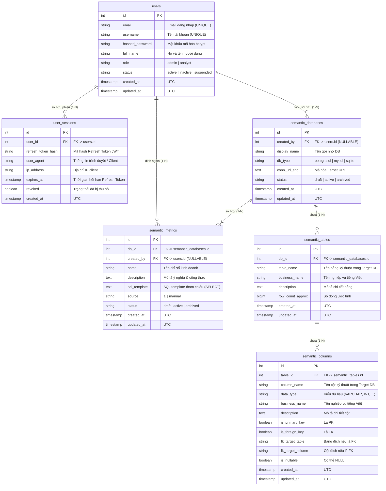

# 🗄️ THIẾT KẾ CƠ SỞ DỮ LIỆU / DATABASE DESIGN SPECIFICATION — METADATA STORE & USER AUTHENTICATION (v1.1)

Tài liệu thiết kế chi tiết cho **Metadata Store** và **Hệ thống Quản lý Người dùng (User Authentication & RBAC)** của dự án **P-069: AI Semantic Layer Agent**.

---

## 1. Sơ đồ Quan hệ Thực thể (ERD — Entity Relationship Diagram)

---

## 2. Quy chuẩn Bảng & Cột (Table Specifications)

### 2.1 Bảng `users` (Quản lý Người dùng & Xác thực)
Lưu trữ thông tin tài khoản, mật khẩu băm và phân quyền người dùng trong hệ thống.

| Tên cột | Kiểu dữ liệu | Ràng buộc | Mô tả |
|---|---|---|---|
| `id` | `INTEGER` | `PRIMARY KEY`, `AUTOINCREMENT` | Khóa chính |
| `email` | `VARCHAR(255)` | `UNIQUE`, `NOT NULL` | Email người dùng (dùng đăng nhập) |
| `username` | `VARCHAR(100)` | `UNIQUE`, `NOT NULL` | Tên tài khoản độc nhất |
| `hashed_password` | `VARCHAR(255)` | `NOT NULL` | Mật khẩu băm (Bcrypt hash) |
| `full_name` | `VARCHAR(200)` | `NOT NULL`, `DEFAULT ''` | Họ và tên hiển thị |
| `role` | `VARCHAR(50)` | `NOT NULL`, `DEFAULT 'analyst'` | Vai trò (`admin`, `analyst`, `viewer`) |
| `status` | `VARCHAR(50)` | `NOT NULL`, `DEFAULT 'active'` | Trạng thái (`active`, `inactive`, `suspended`) |
| `created_at` | `DATETIME / TIMESTAMPTZ` | `NOT NULL` | Thời gian tạo tài khoản (UTC) |
| `updated_at` | `DATETIME / TIMESTAMPTZ` | `NOT NULL` | Thời gian cập nhật (UTC) |

> **Index:** `CREATE UNIQUE INDEX idx_users_email ON users (email);`  
> **Index:** `CREATE UNIQUE INDEX idx_users_username ON users (username);`

---

### 2.2 Bảng `user_sessions` (Quản lý Phiên làm việc & Refresh Token)
Lưu vết phiên đăng nhập, JWT Refresh Tokens và danh sách token thu hồi.

| Tên cột | Kiểu dữ liệu | Ràng buộc | Mô tả |
|---|---|---|---|
| `id` | `INTEGER` | `PRIMARY KEY`, `AUTOINCREMENT` | Khóa chính |
| `user_id` | `INTEGER` | `FK -> users.id ON DELETE CASCADE`, `NOT NULL` | ID người dùng sở hữu phiên |
| `refresh_token_hash` | `VARCHAR(255)` | `NOT NULL`, `UNIQUE` | Mã băm của Refresh Token |
| `user_agent` | `VARCHAR(500)` | `NULLABLE` | Thông tin Trình duyệt / Client device |
| `ip_address` | `VARCHAR(45)` | `NULLABLE` | Địa chỉ IP đăng nhập |
| `expires_at` | `DATETIME / TIMESTAMPTZ` | `NOT NULL` | Thời điểm token hết hạn (UTC) |
| `revoked` | `BOOLEAN` | `NOT NULL`, `DEFAULT FALSE` | Đã thu hồi / Đăng xuất chưa |
| `created_at` | `DATETIME / TIMESTAMPTZ` | `NOT NULL` | Thời gian tạo phiên (UTC) |

> **Index:** `CREATE INDEX idx_user_sessions_user ON user_sessions (user_id);`  
> **Index:** `CREATE INDEX idx_user_sessions_token ON user_sessions (refresh_token_hash);`

---

### 2.3 Bảng `semantic_databases`
Lưu vết các cơ sở dữ liệu đích (Target Databases) đã được kết nối hoặc nạp schema.

| Tên cột | Kiểu dữ liệu | Ràng buộc | Mô tả |
|---|---|---|---|
| `id` | `INTEGER` | `PRIMARY KEY`, `AUTOINCREMENT` | Khóa chính |
| `created_by` | `INTEGER` | `FK -> users.id ON DELETE SET NULL`, `NULLABLE` | ID người tạo / sở hữu ngữ cảnh DB |
| `display_name` | `VARCHAR(200)` | `NOT NULL` | Tên hiển thị người dùng đặt |
| `db_type` | `VARCHAR(50)` | `NOT NULL` | Loại DB (`postgresql`, `mysql`, `sqlite`) |
| `conn_url_enc` | `TEXT` | `NOT NULL` | Connection URL đã mã hóa bằng Fernet |
| `status` | `VARCHAR(50)` | `NOT NULL`, `DEFAULT 'draft'` | Trạng thái (`draft`, `active`, `archived`) |
| `created_at` | `DATETIME / TIMESTAMPTZ` | `NOT NULL` | Thời gian tạo (UTC) |
| `updated_at` | `DATETIME / TIMESTAMPTZ` | `NOT NULL` | Thời gian cập nhật (UTC) |

---

### 2.4 Bảng `semantic_tables`
Lưu trữ danh sách các bảng đã được AI enrich tên tiếng Việt và mô tả.

| Tên cột | Kiểu dữ liệu | Ràng buộc | Mô tả |
|---|---|---|---|
| `id` | `INTEGER` | `PRIMARY KEY`, `AUTOINCREMENT` | Khóa chính |
| `db_id` | `INTEGER` | `FK -> semantic_databases.id ON DELETE CASCADE`, `NOT NULL` | ID cơ sở dữ liệu sở hữu |
| `table_name` | `VARCHAR(200)` | `NOT NULL` | Tên bảng gốc trong Target DB |
| `business_name` | `VARCHAR(200)` | `NOT NULL` | Tên nghiệp vụ tiếng Việt do AI đề xuất / BA duyệt |
| `description` | `TEXT` | `NOT NULL`, `DEFAULT ''` | Mô tả chi tiết ý nghĩa nghiệp vụ |
| `row_count_approx` | `BIGINT` | `NULLABLE` | Số hàng ước tính |
| `created_at` | `DATETIME / TIMESTAMPTZ` | `NOT NULL` | Thời gian tạo (UTC) |
| `updated_at` | `DATETIME / TIMESTAMPTZ` | `NOT NULL` | Thời gian cập nhật (UTC) |

> **Ràng buộc Unique:** `UNIQUE(db_id, table_name)` — Mỗi DB không được có 2 bảng trùng tên kỹ thuật.

---

### 2.5 Bảng `semantic_columns`
Lưu trữ danh sách các cột đã được AI enrich tên tiếng Việt và mô tả.

| Tên cột | Kiểu dữ liệu | Ràng buộc | Mô tả |
|---|---|---|---|
| `id` | `INTEGER` | `PRIMARY KEY`, `AUTOINCREMENT` | Khóa chính |
| `table_id` | `INTEGER` | `FK -> semantic_tables.id ON DELETE CASCADE`, `NOT NULL` | ID bảng sở hữu |
| `column_name` | `VARCHAR(200)` | `NOT NULL` | Tên cột gốc trong Target DB |
| `data_type` | `VARCHAR(100)` | `NOT NULL` | Kiểu dữ liệu trong Target DB |
| `business_name` | `VARCHAR(200)` | `NOT NULL` | Tên nghiệp vụ tiếng Việt do AI đề xuất / BA duyệt |
| `description` | `TEXT` | `NOT NULL`, `DEFAULT ''` | Mô tả chi tiết ý nghĩa cột |
| `is_primary_key` | `BOOLEAN` | `NOT NULL`, `DEFAULT FALSE` | Cột thuộc Primary Key |
| `is_foreign_key` | `BOOLEAN` | `NOT NULL`, `DEFAULT FALSE` | Cột thuộc Foreign Key |
| `fk_target_table` | `VARCHAR(200)` | `NULLABLE` | Tên bảng tham chiếu nếu là FK |
| `fk_target_column` | `VARCHAR(200)` | `NULLABLE` | Tên cột tham chiếu nếu là FK |
| `is_nullable` | `BOOLEAN` | `NOT NULL`, `DEFAULT TRUE` | Cột chấp nhận giá trị NULL |
| `created_at` | `DATETIME / TIMESTAMPTZ` | `NOT NULL` | Thời gian tạo (UTC) |
| `updated_at` | `DATETIME / TIMESTAMPTZ` | `NOT NULL` | Thời gian cập nhật (UTC) |

> **Ràng buộc Unique:** `UNIQUE(table_id, column_name)` — Mỗi bảng không được có 2 cột trùng tên kỹ thuật.

---

### 2.6 Bảng `semantic_metrics`
Thư viện Business Metrics chính thức của doanh nghiệp (Single Source of Truth).

| Tên cột | Kiểu dữ liệu | Ràng buộc | Mô tả |
|---|---|---|---|
| `id` | `INTEGER` | `PRIMARY KEY`, `AUTOINCREMENT` | Khóa chính |
| `db_id` | `INTEGER` | `FK -> semantic_databases.id ON DELETE CASCADE`, `NOT NULL` | ID cơ sở dữ liệu sở hữu |
| `created_by` | `INTEGER` | `FK -> users.id ON DELETE SET NULL`, `NULLABLE` | ID người tạo metric |
| `name` | `VARCHAR(200)` | `NOT NULL` | Tên chỉ số (VD: "Tổng doanh thu thuần") |
| `description` | `TEXT` | `NOT NULL` | Mô tả công thức & ý nghĩa kinh doanh |
| `sql_template` | `TEXT` | `NOT NULL` | Mẫu câu truy vấn SQL tham chiếu (chỉ SELECT) |
| `source` | `VARCHAR(20)` | `NOT NULL`, `DEFAULT 'manual'` | Nguồn gốc chỉ số (`ai` hoặc `manual`) |
| `status` | `VARCHAR(20)` | `NOT NULL`, `DEFAULT 'active'` | Trạng thái (`draft`, `active`, `archived`) |
| `created_at` | `DATETIME / TIMESTAMPTZ` | `NOT NULL` | Thời gian tạo (UTC) |
| `updated_at` | `DATETIME / TIMESTAMPTZ` | `NOT NULL` | Thời gian cập nhật (UTC) |

> **Index:** `CREATE INDEX idx_semantic_metrics_db_name ON semantic_metrics (db_id, name);`

---

## 3. Quy tắc Bảo mật & Dữ liệu (Security & Authentication Protocol)

1. **Mã hóa Mật khẩu Người dùng (Password Hashing):**
   - Mật khẩu đăng ký của người dùng **bắt buộc băm bằng Bcrypt** với salt ngẫu nhiên và cost factor `12`.
   - Tuyệt đối không lưu plaintext password trong DB hoặc log file.

2. **Cơ chế Xác thực JWT (JSON Web Token Authentication):**
   - **Access Token:** Ngắn hạn (ví dụ: 15-30 phút), chứa `user_id`, `email`, `role`. Trình duyệt đính kèm header `Authorization: Bearer <token>`.
   - **Refresh Token:** Dài hạn (ví dụ: 7 ngày), được mã hóa hash và lưu vào bảng `user_sessions`. Khi đăng xuất, token sẽ bị đánh dấu `revoked = TRUE`.

3. **Phân quyền dựa trên Vai trò (Role-Based Access Control - RBAC):**
   - `admin`: Quyền cao nhất, quản lý người dùng, xem và cấu hình toàn bộ databases & metrics.
   - `analyst`: Tạo và quản lý ngữ cảnh DB của chính mình, chạy Flow 1 AI Enrichment, chỉnh sửa HITL, định nghĩa metrics.
   - `viewer`: Chỉ xem danh sách bảng, cột và metrics đã được duyệt (HITL approved), xuất file JSON/YAML.

4. **Cô lập Dữ liệu Multi-Tenancy:**
   - Trường `created_by` trong `semantic_databases` giúp lọc danh sách DB theo người tạo. User thông thường chỉ truy cập được DB do chính mình sở hữu trừ khi được chia sẻ hoặc bởi `admin`.

5. **Fernet Credential Encryption cho Target DB:**
   - Trường `conn_url_enc` trong `semantic_databases` **luôn mã hóa** bằng key `ENCRYPTION_KEY` trong môi trường (`.env`) sử dụng `cryptography.fernet.Fernet`.

6. **Cascade Deletion:**
   - Khi xóa 1 `users`, toàn bộ phiên `user_sessions` liên quan sẽ tự động xóa sạch qua `ON DELETE CASCADE`. Trường `created_by` tại `semantic_databases` và `semantic_metrics` chuyển về `NULL` (`ON DELETE SET NULL`).
   - Khi xóa 1 record trong `semantic_databases`, toàn bộ `semantic_tables`, `semantic_columns` và `semantic_metrics` tương ứng xóa sạch qua `ON DELETE CASCADE`.

7. **Multi-DB & Async Engine Compatibility:**
   - Sử dụng SQLAlchemy 2.0 AsyncEngine với driver `asyncpg` (`postgresql+asyncpg://`) cho PostgreSQL Metadata Store ở sản phẩm và `aiosqlite` (`sqlite+aiosqlite://`) cho SQLite testing. Tích hợp tự động chuyển đổi driver prefix.
