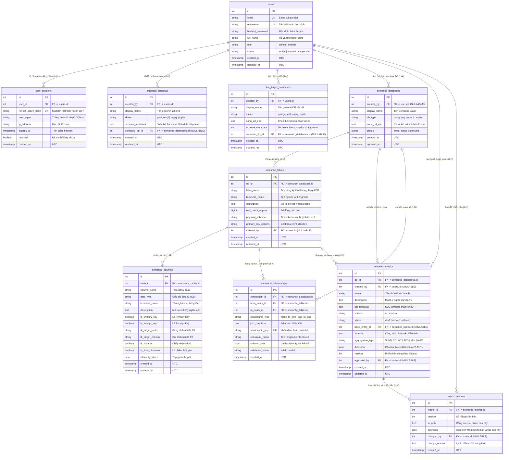

# 🗄️ THIẾT KẾ CƠ SỞ DỮ LIỆU / DATABASE DESIGN SPECIFICATION — METADATA STORE & AUTHENTICATION (v2.0)

Tài liệu thiết kế chi tiết cho **Metadata Store (10 Bảng ORM)** và **Hệ thống Quản lý Người dùng (User Authentication & RBAC)** của dự án **P-069: AI Semantic Layer Agent**.

---

## 1. Sơ đồ Quan hệ Thực thể (ERD — Entity Relationship Diagram)

---

## 2. Quy chuẩn Chi tiết 10 Bảng (Table Specifications)

### 2.1. Bảng `users` (Quản lý Tài khoản & Xác thực)
Lưu trữ thông tin tài khoản, mật khẩu băm và phân quyền RBAC.

| Tên cột | Kiểu dữ liệu | Ràng buộc | Giá trị mặc định | Mô tả |
|---|---|---|---|---|
| `id` | `INTEGER` | `PRIMARY KEY`, `AUTOINCREMENT` | — | Khóa chính người dùng |
| `email` | `VARCHAR(255)` | `NOT NULL`, `UNIQUE` | — | Email tài khoản (dùng đăng nhập) |
| `username` | `VARCHAR(100)` | `NOT NULL`, `UNIQUE` | — | Tên đăng nhập độc nhất |
| `hashed_password` | `VARCHAR(255)` | `NOT NULL` | — | Mật khẩu băm an toàn (Bcrypt) |
| `full_name` | `VARCHAR(200)` | `NOT NULL` | `''` | Họ tên hiển thị người dùng |
| `role` | `VARCHAR(50)` | `NOT NULL` | `'analyst'` | Phân quyền: `admin` hoặc `analyst` |
| `status` | `VARCHAR(50)` | `NOT NULL` | `'active'` | Trạng thái: `active`, `inactive`, `suspended` |
| `created_at` | `TIMESTAMPTZ` | `NOT NULL` | `utc_now` | Thời gian tạo tài khoản |
| `updated_at` | `TIMESTAMPTZ` | `NOT NULL` | `utc_now` | Thời gian cập nhật gần nhất |

- **Indexes:** `idx_users_email (email UNIQUE)`, `idx_users_username (username UNIQUE)`

---

### 2.2. Bảng `user_sessions` (Quản lý Phiên làm việc & Token)
Theo dõi Refresh Tokens, phiên đăng nhập đang hoạt động và danh sách token đã thu hồi.

| Tên cột | Kiểu dữ liệu | Ràng buộc | Giá trị mặc định | Mô tả |
|---|---|---|---|---|
| `id` | `INTEGER` | `PRIMARY KEY`, `AUTOINCREMENT` | — | Khóa chính phiên |
| `user_id` | `INTEGER` | `NOT NULL`, `FK -> users.id ON DELETE CASCADE` | — | ID người dùng sở hữu |
| `refresh_token_hash` | `VARCHAR(255)` | `NOT NULL`, `UNIQUE` | — | Mã băm của JWT Refresh Token |
| `user_agent` | `VARCHAR(500)` | `NULLABLE` | `NULL` | Thông tin Client/Browser |
| `ip_address` | `VARCHAR(45)` | `NULLABLE` | `NULL` | Địa chỉ IP đăng nhập |
| `expires_at` | `TIMESTAMPTZ` | `NOT NULL` | — | Thời điểm Refresh Token hết hạn |
| `revoked` | `BOOLEAN` | `NOT NULL` | `FALSE` | Đánh dấu token đã bị thu hồi / đăng xuất |
| `created_at` | `TIMESTAMPTZ` | `NOT NULL` | `utc_now` | Thời gian tạo phiên |

- **Indexes:** `idx_user_sessions_user (user_id)`, `idx_user_sessions_token (refresh_token_hash)`

---

### 2.3. Bảng `imported_schemas` (Lưu trữ Schema từ SQL Dump)
Lưu trữ Technical Metadata của các schema được nạp từ file SQL Dump DDL.

| Tên cột | Kiểu dữ liệu | Ràng buộc | Giá trị mặc định | Mô tả |
|---|---|---|---|---|
| `id` | `INTEGER` | `PRIMARY KEY`, `AUTOINCREMENT` | — | Khóa chính schema dump |
| `created_by` | `INTEGER` | `NOT NULL`, `FK -> users.id ON DELETE CASCADE` | — | Người tải lên schema |
| `display_name` | `VARCHAR(200)` | `NOT NULL` | — | Tên gợi nhớ schema dump |
| `dialect` | `VARCHAR(50)` | `NOT NULL` | — | Dialect SQL (`postgresql`, `mysql`, `sqlite`) |
| `schema_metadata` | `JSON` | `NOT NULL` | — | Cấu trúc `RawSchemaMetadata` trích xuất |
| `semantic_db_id` | `INTEGER` | `NULLABLE`, `FK -> semantic_databases.id ON DELETE SET NULL` | `NULL` | Liên kết sang Semantic Layer nếu đã sinh |
| `created_at` | `TIMESTAMPTZ` | `NOT NULL` | `utc_now` | Thời gian tải lên |
| `updated_at` | `TIMESTAMPTZ` | `NOT NULL` | `utc_now` | Thời gian cập nhật |

- **Indexes:** `idx_imported_schemas_owner_updated (created_by, updated_at)`

---

### 2.4. Bảng `live_target_databases` (Quản lý Kết nối Target DB)
Lưu trữ cấu hình kết nối và Technical Metadata của Target Live DB.

| Tên cột | Kiểu dữ liệu | Ràng buộc | Giá trị mặc định | Mô tả |
|---|---|---|---|---|
| `id` | `INTEGER` | `PRIMARY KEY`, `AUTOINCREMENT` | — | Khóa chính kết nối |
| `created_by` | `INTEGER` | `NOT NULL`, `FK -> users.id ON DELETE CASCADE` | — | Người tạo kết nối |
| `display_name` | `VARCHAR(200)` | `NOT NULL` | — | Tên hiển thị của DB đích |
| `dialect` | `VARCHAR(50)` | `NOT NULL` | — | Dialect DB (`postgresql`, `mysql`, `sqlite`) |
| `conn_url_enc` | `TEXT` | `NOT NULL` | — | Chuỗi kết nối mã hóa Fernet đối xứng |
| `schema_metadata` | `JSON` | `NOT NULL` | — | Metadata cấu trúc đọc từ Inspector |
| `semantic_db_id` | `INTEGER` | `NULLABLE`, `FK -> semantic_databases.id ON DELETE SET NULL` | `NULL` | Liên kết sang Semantic Layer tương ứng |
| `created_at` | `TIMESTAMPTZ` | `NOT NULL` | `utc_now` | Thời gian tạo kết nối |
| `updated_at` | `TIMESTAMPTZ` | `NOT NULL` | `utc_now` | Thời gian cập nhật |

- **Indexes:** `idx_live_target_dbs_owner_updated (created_by, updated_at)`

---

### 2.5. Bảng `semantic_databases` (Semantic Layer Context)
Đại diện cho một không gian ngữ nghĩa (Semantic Layer) độc lập.

| Tên cột | Kiểu dữ liệu | Ràng buộc | Giá trị mặc định | Mô tả |
|---|---|---|---|---|
| `id` | `INTEGER` | `PRIMARY KEY`, `AUTOINCREMENT` | — | Khóa chính Semantic Layer |
| `created_by` | `INTEGER` | `NULLABLE`, `FK -> users.id ON DELETE SET NULL` | `NULL` | Người khởi tạo layer |
| `display_name` | `VARCHAR(200)` | `NOT NULL` | — | Tên hiển thị Semantic Layer |
| `db_type` | `VARCHAR(50)` | `NOT NULL` | — | Loại DB (`postgresql`, `mysql`, `sqlite`) |
| `conn_url_enc` | `TEXT` | `NOT NULL` | — | Chuỗi kết nối mã hóa Fernet (nếu là Live DB) |
| `status` | `VARCHAR(50)` | `NOT NULL` | `'draft'` | Trạng thái: `draft`, `active`, `archived` |
| `created_at` | `TIMESTAMPTZ` | `NOT NULL` | `utc_now` | Thời gian tạo |
| `updated_at` | `TIMESTAMPTZ` | `NOT NULL` | `utc_now` | Thời gian cập nhật |

---

### 2.6. Bảng `semantic_tables` (Bảng Ngữ Nghĩa)
Lưu thông tin bảng kỹ thuật kèm tên nghiệp vụ và mô tả sau khi được enrich.

| Tên cột | Kiểu dữ liệu | Ràng buộc | Giá trị mặc định | Mô tả |
|---|---|---|---|---|
| `id` | `INTEGER` | `PRIMARY KEY`, `AUTOINCREMENT` | — | Khóa chính bảng ngữ nghĩa |
| `db_id` | `INTEGER` | `NOT NULL`, `FK -> semantic_databases.id ON DELETE CASCADE` | — | Thuộc Semantic Layer nào |
| `table_name` | `VARCHAR(200)` | `NOT NULL` | — | Tên bảng gốc kỹ thuật |
| `business_name` | `VARCHAR(200)` | `NOT NULL` | — | Tên nghiệp vụ tiếng Việt |
| `description` | `TEXT` | `NOT NULL` | `''` | Mô tả chi tiết nghiệp vụ của bảng |
| `row_count_approx` | `BIGINT` | `NULLABLE` | `NULL` | Số dòng ước tính |
| `physical_schema` | `VARCHAR(200)` | `NULLABLE` | `NULL` | Schema vật lý (VD: `public`) |
| `primary_key_column`| `VARCHAR(200)` | `NULLABLE` | `NULL` | Cột khóa chính chính đại diện |
| `created_by` | `INTEGER` | `NULLABLE`, `FK -> users.id ON DELETE SET NULL` | `NULL` | Người tạo/sửa |
| `created_at` | `TIMESTAMPTZ` | `NOT NULL` | `utc_now` | Thời gian tạo |
| `updated_at` | `TIMESTAMPTZ` | `NOT NULL` | `utc_now` | Thời gian cập nhật |

- **Unique Constraint:** `uq_semantic_tables_db_table (db_id, table_name)`

---

### 2.7. Bảng `semantic_columns` (Cột Ngữ Nghĩa)
Lưu thông tin cột kỹ thuật, kiểu dữ liệu, vai trò quan hệ và tên nghiệp vụ.

| Tên cột | Kiểu dữ liệu | Ràng buộc | Giá trị mặc định | Mô tả |
|---|---|---|---|---|
| `id` | `INTEGER` | `PRIMARY KEY`, `AUTOINCREMENT` | — | Khóa chính cột ngữ nghĩa |
| `table_id` | `INTEGER` | `NOT NULL`, `FK -> semantic_tables.id ON DELETE CASCADE` | — | Thuộc bảng ngữ nghĩa nào |
| `column_name` | `VARCHAR(200)` | `NOT NULL` | — | Tên cột kỹ thuật |
| `data_type` | `VARCHAR(100)` | `NOT NULL` | — | Kiểu dữ liệu (`INTEGER`, `VARCHAR`, `TIMESTAMP`...) |
| `business_name` | `VARCHAR(200)` | `NOT NULL` | — | Tên nghiệp vụ tiếng Việt |
| `description` | `TEXT` | `NOT NULL` | `''` | Mô tả chi tiết ý nghĩa cột |
| `is_primary_key` | `BOOLEAN` | `NOT NULL` | `FALSE` | Cột là Primary Key |
| `is_foreign_key` | `BOOLEAN` | `NOT NULL` | `FALSE` | Cột là Foreign Key |
| `fk_target_table` | `VARCHAR(200)` | `NULLABLE` | `NULL` | Bảng đích tham chiếu nếu là FK |
| `fk_target_column`| `VARCHAR(200)` | `NULLABLE` | `NULL` | Cột đích tham chiếu nếu là FK |
| `is_nullable` | `BOOLEAN` | `NOT NULL` | `TRUE` | Cho phép nhận giá trị NULL |
| `is_time_dimension`| `BOOLEAN` | `NOT NULL` | `FALSE` | Là trục thời gian cho Metric Explorer |
| `allowed_values` | `JSON` | `NULLABLE` | `NULL` | Danh sách giá trị hợp lệ / Enum |
| `created_at` | `TIMESTAMPTZ` | `NOT NULL` | `utc_now` | Thời gian tạo |
| `updated_at` | `TIMESTAMPTZ` | `NOT NULL` | `utc_now` | Thời gian cập nhật |

- **Unique Constraint:** `uq_semantic_columns_table_col (table_id, column_name)`

---

### 2.8. Bảng `semantic_metrics` (Thư viện Business Metrics)
Quản trị chỉ số kinh doanh chính thức, công thức tính toán và trạng thái phê duyệt.

| Tên cột | Kiểu dữ liệu | Ràng buộc | Giá trị mặc định | Mô tả |
|---|---|---|---|---|
| `id` | `INTEGER` | `PRIMARY KEY`, `AUTOINCREMENT` | — | Khóa chính chỉ số |
| `db_id` | `INTEGER` | `NOT NULL`, `FK -> semantic_databases.id ON DELETE CASCADE` | — | Thuộc Semantic Layer nào |
| `created_by` | `INTEGER` | `NULLABLE`, `FK -> users.id ON DELETE SET NULL` | `NULL` | Người khởi tạo metric |
| `name` | `VARCHAR(200)` | `NOT NULL` | — | Tên chỉ số kinh doanh |
| `description` | `TEXT` | `NOT NULL` | — | Mô tả ý nghĩa kinh doanh |
| `sql_template` | `TEXT` | `NOT NULL` | — | Mẫu câu truy vấn SQL tham chiếu |
| `source` | `VARCHAR(20)` | `NOT NULL` | `'manual'` | Nguồn gốc: `ai` hoặc `manual` |
| `status` | `VARCHAR(20)` | `NOT NULL` | `'draft'` | Trạng thái: `draft`, `active`, `archived` |
| `base_entity_id` | `INTEGER` | `NULLABLE`, `FK -> semantic_tables.id ON DELETE SET NULL` | `NULL` | Bảng cơ sở chứa metric |
| `formula` | `TEXT` | `NOT NULL` | `''` | Công thức tính toán (biểu thức) |
| `aggregation_type`| `VARCHAR(50)` | `NULLABLE` | `NULL` | Loại tổng hợp: `SUM`, `COUNT`, `AVG`... |
| `definition` | `JSON` | `NULLABLE` | `NULL` | Payload cấu trúc `MetricDefinition` v2 |
| `version` | `INTEGER` | `NOT NULL` | `1` | Số hiệu phiên bản công thức hiện tại |
| `approved_by` | `INTEGER` | `NULLABLE`, `FK -> users.id ON DELETE SET NULL` | `NULL` | Người phê duyệt metric |
| `created_at` | `TIMESTAMPTZ` | `NOT NULL` | `utc_now` | Thời gian tạo |
| `updated_at` | `TIMESTAMPTZ` | `NOT NULL` | `utc_now` | Thời gian cập nhật |

- **Indexes:** `idx_semantic_metrics_db_name (db_id, name)`

---

### 2.9. Bảng `canonical_relationships` (Quan hệ Liên Bảng Chuẩn Hóa)
Định nghĩa mối quan hệ liên kết giữa các bảng ngữ nghĩa phục vụ giải quyết đường đi JOIN trong Flow 2.

| Tên cột | Kiểu dữ liệu | Ràng buộc | Giá trị mặc định | Mô tả |
|---|---|---|---|---|
| `id` | `INTEGER` | `PRIMARY KEY`, `AUTOINCREMENT` | — | Khóa chính quan hệ |
| `connection_id` | `INTEGER` | `NOT NULL`, `FK -> semantic_databases.id ON DELETE CASCADE` | — | Thuộc Semantic Layer nào |
| `from_entity_id` | `INTEGER` | `NOT NULL`, `FK -> semantic_tables.id ON DELETE CASCADE` | — | Bảng nguồn (From Table) |
| `to_entity_id` | `INTEGER` | `NOT NULL`, `FK -> semantic_tables.id ON DELETE CASCADE` | — | Bảng đích (To Table) |
| `relationship_type`| `VARCHAR(50)` | `NOT NULL` | — | Loại quan hệ (`many_to_one`, `one_to_one`) |
| `join_condition` | `TEXT` | `NOT NULL` | — | Biểu thức điều kiện `JOIN ON` |
| `relationship_key`| `VARCHAR(500)` | `NOT NULL` | Function default | Khóa định danh xác định tính duy nhất |
| `constraint_name` | `VARCHAR(200)` | `NULLABLE` | `NULL` | Tên ràng buộc khóa ngoại nếu có |
| `column_pairs` | `JSON` | `NOT NULL` | `[]` | Danh sách ID các cặp cột kết nối |
| `validation_status`| `VARCHAR(20)` | `NOT NULL` | `'valid'` | Trạng thái kiểm tra: `valid` hoặc `invalid` |
| `created_at` | `TIMESTAMPTZ` | `NOT NULL` | `utc_now` | Thời gian ghi nhận |

- **Unique Constraint:** `uq_canonical_rel_key (connection_id, relationship_key)`

---

### 2.10. Bảng `metric_versions` (Lịch sử Phiên bản Chỉ số)
Lưu vết toàn bộ các lần thay đổi công thức và định nghĩa của Business Metric (Audit Trail).

| Tên cột | Kiểu dữ liệu | Ràng buộc | Giá trị mặc định | Mô tả |
|---|---|---|---|---|
| `id` | `INTEGER` | `PRIMARY KEY`, `AUTOINCREMENT` | — | Khóa chính bản ghi version |
| `metric_id` | `INTEGER` | `NOT NULL`, `FK -> semantic_metrics.id ON DELETE CASCADE` | — | Thuộc Metric nào |
| `version` | `INTEGER` | `NOT NULL` | — | Số hiệu phiên bản tại thời điểm đó |
| `formula` | `TEXT` | `NOT NULL` | — | Công thức tính toán tại phiên bản này |
| `definition` | `JSON` | `NULLABLE` | `NULL` | Payload `MetricDefinition` tại phiên bản này |
| `changed_by` | `INTEGER` | `NULLABLE`, `FK -> users.id ON DELETE SET NULL` | `NULL` | Người thực hiện chỉnh sửa |
| `change_reason` | `TEXT` | `NOT NULL` | `''` | Ghi chú / Lý do điều chỉnh |
| `created_at` | `TIMESTAMPTZ` | `NOT NULL` | `utc_now` | Thời điểm tạo phiên bản |

- **Indexes:** `idx_metric_versions_metric_version (metric_id, version)`

---

## 3. Ràng buộc Khóa Ngoại & Xóa Dây Chuyền (Cascading Rules)

1. **Xóa Tài khoản (`users`):**
   - Các bảng `user_sessions`, `imported_schemas`, `live_target_databases` được xóa triệt để (`ON DELETE CASCADE`).
   - Các trường `created_by` hoặc `approved_by` trong `semantic_databases`, `semantic_tables`, `semantic_metrics`, `metric_versions` chuyển về `NULL` (`ON DELETE SET NULL`) để bảo toàn dữ liệu tri thức của tổ chức.
2. **Xóa Semantic Layer (`semantic_databases`):**
   - Toàn bộ `semantic_tables`, `semantic_columns`, `semantic_metrics`, `canonical_relationships` và các `metric_versions` liên quan sẽ tự động được thu hồi và xóa sạch qua `ON DELETE CASCADE`.
3. **Xóa Bảng Ngữ Nghĩa (`semantic_tables`):**
   - Tự động xóa toàn bộ `semantic_columns` và các `canonical_relationships` liên quan đến bảng đó (`ON DELETE CASCADE`).
