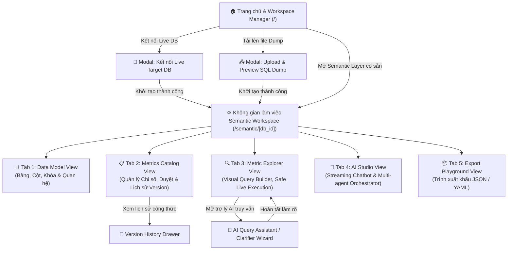

# 🎨 Wireframe & UI Flow Document — AI Semantic Layer Agent (v2.0)

> **Tài liệu:** Thiết kế Luồng Màn hình (UI Flow) & Bố cục Giao diện (Wireframes)  
> **Dự án:** AI Semantic Layer Agent (P-069)  
> **Framework:** Next.js 14 (App Router) + Tailwind CSS + Lucide Icons + PrismJS  

---

## 1. Luồng Di chuyển Người dùng (User Navigation Flow)



---

## 2. Bố cục Giao diện & Wireframes Chi tiết

---

### 🖥️ Màn hình 1: Landing Page & Workspace Manager (`/`)

Trang bắt đầu cho phép người dùng lựa chọn:
1. Kết nối Target Database thực tế (PostgreSQL, MySQL, SQLite)
2. Tải lên file SQL Dump DDL (`.sql`) với tính năng xem trước cấu trúc (Technical Preview)
3. Mở các không gian làm việc Semantic Layer đã lưu trước đó.

```
+-----------------------------------------------------------------------------------------+
| 🤖 AI SEMANTIC LAYER AGENT                     [ Docs ]  [ Tài khoản ]  [ Đăng xuất ]  |
+-----------------------------------------------------------------------------------------+
|                                                                                         |
|  KHỞI TẠO SEMANTIC LAYER MỚI                                                           |
|  +---------------------------------------+  +----------------------------------------+  |
|  | 🔌 Kết nối Live Target DB              |  | 📥 Tải lên SQL Dump File (.sql)        |  |
|  | PostgreSQL, MySQL, SQLite              |  | Phân tích DDL không cần kết nối mạng   |  |
|  | [ + Tạo Kết nối Mới ]                 |  | [ ⬆ Tải File Dump Lên ]               |  |
|  +---------------------------------------+  +----------------------------------------+  |
|                                                                                         |
| ======================================================================================= |
|                                                                                         |
|  📁 KHÔNG GIAN LÀM VIỆC ĐÃ TẠO (SEMANTIC WORKSPACES)                                    |
|  +--------------------------+------------+---------------+-------------+--------------+ |
|  | Tên Database / Workspace | Nguồn      | Số bảng / Cột | Cập nhật    | Thao tác     | |
|  +--------------------------+------------+---------------+-------------+--------------+ |
|  | Golden Retail Prod DB    | Live DB    | 36 bảng / 140 | 10 phút trước| [ Vào làm việc] |
|  | E-Commerce Schema Dump   | SQL Dump   | 18 bảng / 72  | Hôm qua     | [ Vào làm việc] |
|  +--------------------------+------------+---------------+-------------+--------------+ |
+-----------------------------------------------------------------------------------------+
```

---

### ⚙️ Màn hình 2: Semantic Workspace Header & Tab Navigation (`/semantic/[db_id]`)

Thanh công cụ đầu trang hiển thị tên Database, trạng thái kết nối và 5 Tab điều hướng cốt lõi:

```
+-----------------------------------------------------------------------------------------+
| ← Trang chủ | 🗄️ Golden Retail Prod DB (PostgreSQL)  [ Trạng thái: Active ] [ 💾 Đã lưu ] |
+-----------------------------------------------------------------------------------------+
| [ 📊 Data Model ] [ 📋 Metrics Catalog ] [ 🔍 Metric Explorer ] [ 💬 AI Studio ] [ 📦 Export ] |
+-----------------------------------------------------------------------------------------+
```

---

### 📊 Tab 1: Data Model View (`DataModelView.tsx`)

Hiển thị toàn bộ bảng, cột, khóa chính/ngoại, kiểu dữ liệu và tên nghiệp vụ do AI sinh ra. Cho phép chỉnh sửa inline trực tiếp.

```
+-----------------------------------------------------------------------------------------+
| 🔍 Tìm kiếm bảng/cột...                              [ + Thêm bảng ]  [ ⚡ Sinh lại AI ] |
+-----------------------------------------------------------------------------------------+
| ▼ 📂 Bảng: orders (Đơn hàng) — 5,000 dòng ước tính                          [ Sửa tên/mô tả ]
|    Mô tả: Bảng ghi nhận toàn bộ các đơn hàng phát sinh từ các kênh bán hàng.           |
|                                                                                         |
|    +-------------------+---------------+--------------------+---------+---------------+ |
|    | Tên Cột DB        | Kiểu Dữ Liệu  | Tên Nghiệp Vụ (AI) | Đặc tính| Mô tả Nghiệp Vụ| |
|    +-------------------+---------------+--------------------+---------+---------------+ |
|    | order_id          | INTEGER       | Mã đơn hàng        | [ PK ]  | Mã định danh  | |
|    | customer_id       | INTEGER       | Mã khách hàng      | [ FK ]  | Liên kết KH   | |
|    | order_date        | TIMESTAMP     | Ngày đặt hàng      | [ TIME ]| Trục thời gian| |
|    | total_amount      | NUMERIC(12,2) | Tổng tiền thanh toán| [ NUM ] | Đã gồm VAT    | |
|    +-------------------+---------------+--------------------+---------+---------------+ |
|                                                                                         |
| ▶ 📂 Bảng: customers (Khách hàng)                                                       |
| ▶ 📂 Bảng: order_items (Chi tiết đơn hàng)                                              |
+-----------------------------------------------------------------------------------------+
```

---

### 📋 Tab 2: Metrics Catalog View (`MetricsCatalogView.tsx`)

Quản trị danh mục chỉ số kinh doanh, công thức, trạng thái duyệt và xem lịch sử các phiên bản.

```
+-----------------------------------------------------------------------------------------+
| 🎯 DANH MỤC CHỈ SỐ KINH DOANH (METRICS CATALOG)       [ 🔍 Lọc ]  [ + Thêm Metric Mới ] |
+-----------------------------------------------------------------------------------------+
| +-------------------------------------------------------------------------------------+ |
| | 📈 Tổng Doanh Thu Bán Hàng                               [ Nguồn: AI ] [ ✅ Approved ] |
| | Mô tả: Tổng giá trị các đơn hàng có trạng thái hoàn tất giao dịch.                  |
| | Base Entity: orders  |  Aggregation: SUM  |  Version: v3                           |
| | Công thức: SUM(orders.total_amount) WHERE orders.status = 'completed'               |
| | [ 📜 Xem Lịch sử Phiên bản (Drawer) ]   [ ✏️ Sửa Công thức ]   [ 🗑️ Xóa Metric ]    |
| +-------------------------------------------------------------------------------------+ |
| | 📊 Tỷ Lệ Đổi Trả Hàng (Return Rate)                     [ Nguồn: Manual ] [ 🟡 Draft ] |
| | Base Entity: order_returns  |  Aggregation: CUSTOM  |  Version: v1                  |
| | [ 📜 Xem Lịch sử Phiên bản ]   [ ✅ Duyệt Metric ]   [ ✏️ Sửa ]   [ 🗑️ Xóa ]         |
| +-------------------------------------------------------------------------------------+ |
+-----------------------------------------------------------------------------------------+
```

---

### 🔍 Tab 3: Metric Explorer View (`MetricExplorerView.tsx`)

Trình biên dịch và thực thi truy vấn trực quan: Người dùng chọn Metrics và Dimensions $\rightarrow$ Xem trước câu lệnh SQL $\rightarrow$ Thực thi lấy dữ liệu an toàn từ Live DB.

```
+-----------------------------------------------------------------------------------------+
| 🎛️ BỘ LỌC VÀ CHỌN CHỈ SỐ                         |  🤖 TRỢ LÝ TRUY VẤN AI                |
| Chọn Metrics:     [x] Tổng Doanh Thu              |  [ 💬 Hỏi AI xây dựng truy vấn... ]   |
| Chọn Dimensions:  [x] Kênh bán lẻ (channel_name)  |                                       |
|                   [x] Tháng đặt hàng (month)      |  ⚡ [ Xem SQL ]  ▶️ [ Chạy Truy Vấn ] |
+-----------------------------------------------------------------------------------------+
| 💻 CÂU LỆNH SQL ĐƯỢC BIÊN DỊCH (COMPILED SQL):                                          |
| SELECT c.channel_name, DATE_TRUNC('month', o.order_date) AS month,                      |
|        SUM(o.total_amount) AS tong_doanh_thu                                           |
| FROM orders o JOIN channels c ON o.channel_id = c.channel_id                            |
| GROUP BY 1, 2 ORDER BY 2 DESC LIMIT 100;                                               |
+-----------------------------------------------------------------------------------------+
| 📊 BẢNG DỮ LIỆU THỰC TẾ (LIVE DATA RESULTS — 4 dòng trong 0.04s):                       |
| +-----------------------+-------------------+-----------------------------------------+ |
| | Kênh bán lẻ           | Tháng đặt hàng    | Tổng Doanh Thu (VNĐ)                    | |
| +-----------------------+-------------------+-----------------------------------------+ |
| | Cửa hàng Hà Nội       | 2026-07-01        | 1,450,000,000                           | |
| | Website Online        | 2026-07-01        | 2,120,000,000                           | |
| | Cửa hàng TP.HCM       | 2026-07-01        | 1,890,000,000                           | |
| +-----------------------+-------------------+-----------------------------------------+ |
+-----------------------------------------------------------------------------------------+
```

---

### 💬 Tab 4: AI Studio View (`AIStudioView.tsx`)

Giao diện chat trực tuyến hỗ trợ streaming, tự động nhận diện ý định (Intent Routing) và hiển thị code viewer highlight cú pháp SQL/YAML.

```
+-----------------------------------------------------------------------------------------+
| 💬 TRỢ LÝ AI SEMANTIC STUDIO                                                            |
| +-------------------------------------------------------------------------------------+ |
| | 👤 User: Cho tôi biết cách tính chỉ số Tỷ lệ Chuyển đổi Khách hàng?                   |
| |                                                                                     |
| | 🤖 AI Assistant: Tôi đã phân tích cấu trúc bảng `sessions` và `orders`.             |
| | Dưới đây là công thức MetricDefinition đề xuất:                                     |
| |                                                                                     |
| | ```sql                                                                              |
| | COUNT(DISTINCT orders.customer_id)::FLOAT / COUNT(DISTINCT sessions.visitor_id)     |
| | ```                                                                                 |
| | [ ➕ Lưu Metric này vào Catalog ]                                                    |
| +-------------------------------------------------------------------------------------+ |
| [ Nhập câu hỏi hoặc yêu cầu định nghĩa chỉ số...                           ] [ Gửi ✈️ ] |
+-----------------------------------------------------------------------------------------+
```

---

### 📦 Tab 5: Export Playground View (`ExportPlaygroundView.tsx`)

Trình xem và xuất khẩu Semantic Layer ra chuẩn JSON hoặc YAML.

```
+-----------------------------------------------------------------------------------------+
| 📦 XUẤT BẢN SEMANTIC LAYER                             [ 📑 JSON ]  [ 📑 YAML ]  [ ⬇️ Tải Về ] |
+-----------------------------------------------------------------------------------------+
| version: "2.0"                                                                          |
| database:                                                                               |
|   name: "Golden Retail Prod DB"                                                         |
|   dialect: "postgresql"                                                                 |
| tables:                                                                                 |
|   - name: "orders"                                                                      |
|     business_name: "Đơn hàng"                                                           |
|     description: "Bảng lưu lịch sử mua hàng..."                                         |
| metrics:                                                                                |
|   - name: "Tổng Doanh Thu Bán Hàng"                                                     |
|     aggregation: "SUM"                                                                  |
|     formula: "SUM(orders.total_amount)"                                                 |
+-----------------------------------------------------------------------------------------+
```
