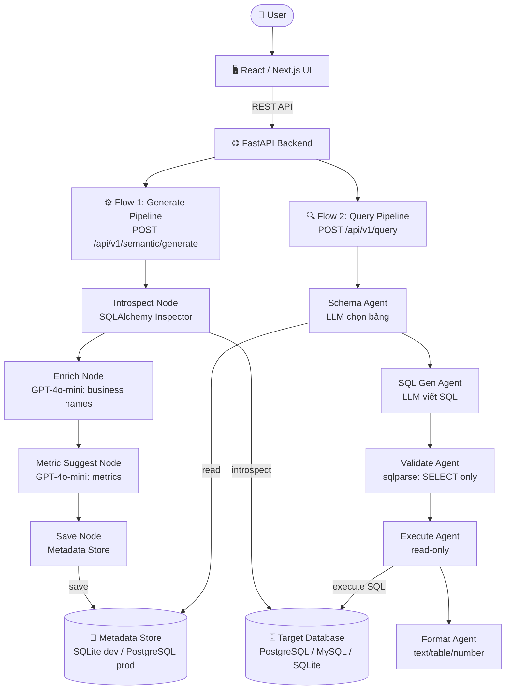
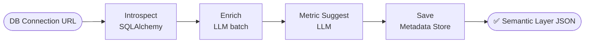
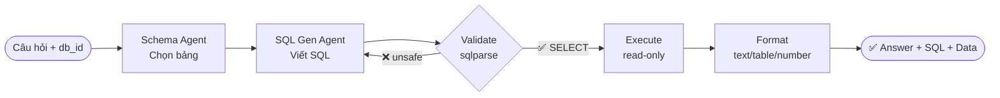

# Architecture Diagram — AI Semantic Layer Agent

## System Overview

---

## Flow 1 — Generate Pipeline

---

## Flow 2 — Query Pipeline

---

## Component Details

| Component | Technology | Purpose |
|-----------|-----------|---------|
| API | FastAPI + Uvicorn | Async REST API |
| Flow 1 Agent | LangGraph StateGraph | Generate Semantic Layer |
| Flow 2 Agent | LangGraph Multi-Agent | NL2SQL query |
| LLM | GPT-4o-mini | Enrich + SQL generation |
| DB Abstraction | SQLAlchemy | Introspection + execution |
| SQL Safety | sqlparse | Whitelist SELECT only |
| Metadata Store | SQLite (dev) / PostgreSQL (prod) | Semantic definitions |
| Target DB | PostgreSQL / MySQL / SQLite | DB người dùng query |
