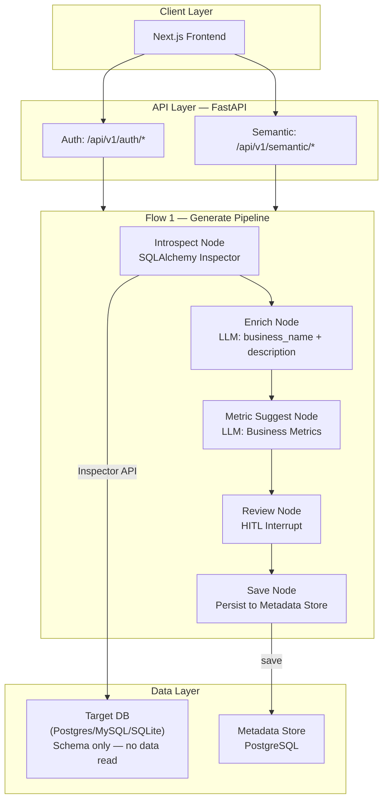

## System Architecture — P-069 AI Semantic Layer Agent

### Overview Diagram

## Components

### 1. Frontend (Next.js)

- **Purpose:** HITL review UI cho BA/DA
- **Key Features:** Inline edit business_name, metric review, export
- **State Management:** React Context (AuthContext)

### 2. Backend (FastAPI)

- **Purpose:** API server xử lý auth + semantic layer pipeline
- **API Design:** RESTful endpoints (`/api/v1/auth/*`, `/api/v1/semantic/*`)
- **Auth:** JWT + Google OAuth

### 3. AI Agent (LangGraph)

- **Agent Type:** Linear pipeline with HITL interrupt
- **State:** `AgentState` TypedDict (`src/agents/state.py`)
- **Nodes:** introspect → enrich → metric_suggest → save
- **Tools:** SQLAlchemy Inspector (schema-only, no data query)

### 4. Database

- **Target DB:** PostgreSQL / MySQL / SQLite (read schema only via Inspector)
- **Metadata Store:** PostgreSQL (ORM via SQLAlchemy, migrations via Alembic)
- **Encryption:** Fernet for connection URLs

### 5. LLM

- **Model:** GPT-4o-mini via `get_llm()` factory (`src/services/llm.py`)
- **Temperature:** 0.0 (deterministic)
- **Usage:** business_name enrichment + metric suggestion

## Data Flow

1. User gửi `POST /api/v1/semantic/generate` với `db_id`
2. Introspect Node đọc schema metadata qua SQLAlchemy Inspector
3. Enrich Node gọi LLM sinh business_name + description (batch 5 bảng)
4. Metric Suggest Node gọi LLM đề xuất Business Metrics
5. HITL interrupt — BA/DA review & approve qua UI
6. Save Node persist vào Metadata Store
7. Export Service xuất JSON/YAML

## Design Decisions

| Decision | Choice | Reason |
|----------|--------|--------|
| Framework | FastAPI | Async, auto-docs, type-safe |
| Agent | LangGraph | StateGraph + HITL Interrupt |
| DB Access | SQLAlchemy Inspector | Schema-only, no data read risk |
| LLM | GPT-4o-mini, T=0.0 | Cost-efficient, deterministic |
| Credential Storage | Fernet encryption | Reversible, symmetric key |
